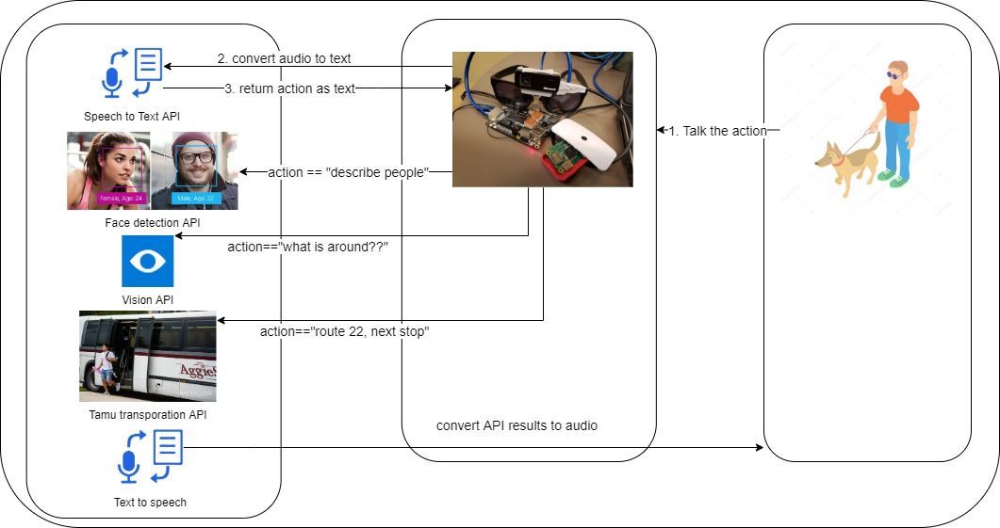

# Horus (cloud-based voice assistant / smart glasses)

## Description

More than 3.4 million (3%) Americans aged 40 years and older are either legally blind or are visually impaired (Eye Diseases Prevalence Research Group, 2004). Globally, people 50 years and older are about 82% of all blind. These are just for the cause of aging, there are more: accidents, born with blindness. Blind people generally always feel unpleasant and unsafe while exploring new environments. We experienced the worst of it as some of our family members faced untreatable blindness and they become incapacitated for the rest of there life.

We know we can not solve the blindness issue but we can make them feel safer by introducing them with the surrounding environment in an interactive way. Assistive bots are doing a great job nowadays helping people, sometimes they are amazingly interactive. So we came up with the question "why not assistive bots are helping blind people to introduce there surrounding?" The scope of this can be boundless. Eventually, they can ask for information like, "What is in my surroundings?", "Describe the people in front of me", "When is the next bus no 22?" and more.

So we developed a smart glasses for blind people, which is a cloud-based voice assistant, using "Microsoft Cognitive Services" in python. We also used a "Microsoft Webcam" as an input device for the glasses and it is running on a LattePanda (A Windows 10 computer board with integrated Arduino).

